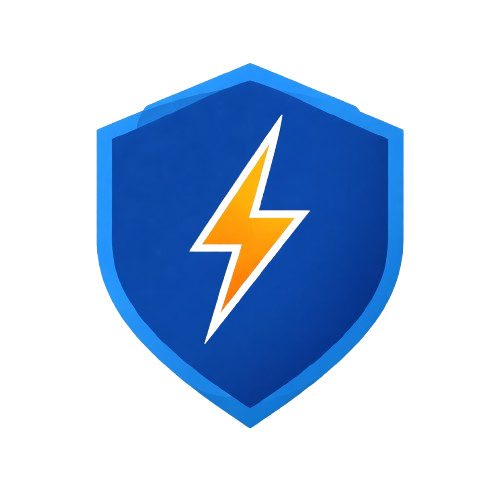
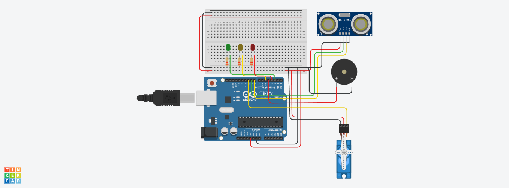
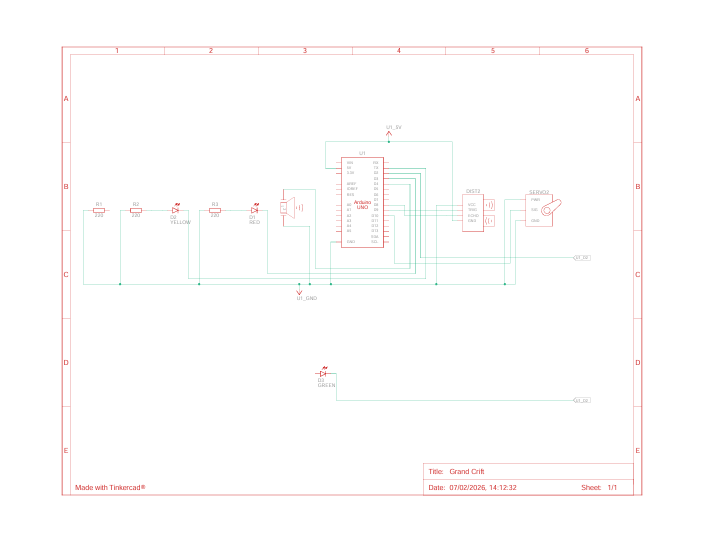

<div align="center">



# ARGUS - Alerta de Risco para Garantia Unificada da Segurança


</div>

## Resumo do Projeto e Objetivo

O **ARGUS – Alerta de Risco para Garantia Unificada da Segurança** é uma solução tecnológica inovadora voltada à **prevenção de acidentes elétricos**, **segurança urbana** e **proteção da vida** em ambientes próximos à rede elétrica.

Inspirado em **Argus Panoptes**, o guardião de cem olhos da mitologia grega, o projeto simboliza **vigilância contínua, antecipação de riscos e resposta preventiva**. Assim como seu homônimo mitológico, o ARGUS “vê antes”, detecta perigos invisíveis e alerta antes que o risco se transforme em acidente.

O sistema integra **hardware embarcado**, **sensoriamento inteligente** e **software de monitoramento**, operando em **postes de iluminação pública**, **canteiros de obras**, **ambientes industriais** e **equipamentos de proteção individual (wearables)**, promovendo uma rede ativa de segurança.

---

## Conceito Geral da Solução

O ARGUS atua como um **ecossistema de segurança elétrica e urbana**, composto por:

- **Sensores inteligentes** instalados em infraestrutura pública e ambientes de risco;
- **Dispositivos embarcados** capazes de identificar padrões perigosos;
- **Processamento local e centralizado**;
- **Alertas geolocalizados em tempo real** enviados para trabalhadores, cidadãos e autoridades.

O objetivo é **democratizar o acesso à informação de segurança**, reduzindo acidentes fatais, arcos voltaicos, choques elétricos, incêndios e riscos invisíveis associados à rede elétrica.

---

## Arquitetura e Princípio de Funcionamento


### 1️. Camada de Hardware (Sensoriamento)

- Sensores de proximidade, campo eletromagnético, temperatura, vibração e ambiente;
- Microcontroladores embarcados (Arduino, ESP32 ou STM32);
- Dispositivos instalados em:
  - Postes de iluminação pública;
  - Andaimes e fachadas;
  - Estruturas metálicas;
  - Equipamentos individuais de trabalhadores.

### 2️. Camada de Comunicação

- **LoRaWAN** (baixo consumo e longo alcance);
- **Mesh Network** para wearables;
- Comunicação resiliente em ambientes com interferência eletromagnética.

### 3️. Camada de Software

- Aplicativo mobile com **mapa de riscos em tempo real**;
- Backend em nuvem para processamento e armazenamento;
- Sistema de notificações push geolocalizadas;
- Registro histórico auditável (compliance CREA / concessionárias).

---


## Protótipo Arduino (Prova de Conceito)

O protótipo físico apresentado neste repositório representa uma **Prova de Conceito (PoC)** do ARGUS, demonstrando:

- Detecção de proximidade por sensor ultrassônico;
- Classificação de risco em três níveis;
- Sinalização visual (LEDs);
- Atuação mecânica preventiva (servo motor simulando corte de energia).

---

## Classificação de Risco (Lógica do Protótipo)

| Distância Detectada | Nível de Risco | Ação |
|--------------------|--------------|------|
| ≥ 150 cm | 🟢 Seguro | LED Verde ligado |
| 50 cm – 149 cm | 🟡 Alerta | LED Amarelo ligado |
| < 50 cm | 🔴 Crítico | LED Vermelho + Servo acionado |

No estado **crítico**, o sistema simula o **bloqueio/corte de energia**, prevenindo acidentes graves.

---

## 🛠️ Especificação de Hardware (BOM)

| Componente | Quantidade | Função |
|-----------|-----------|--------|
| Arduino Uno | 1 | Microcontrolador principal |
| Sensor Ultrassônico HC-SR04 | 1 | Detecção de proximidade |
| Servo Motor SG90 | 1 | Simulação de corte de energia |
| LED Verde | 1 | Indicação de estado seguro |
| LED Amarelo | 1 | Indicação de alerta |
| LED Vermelho | 1 | Indicação crítica |
| Resistores | 3 | Proteção dos LEDs |
| Protoboard | 1 | Montagem do circuito |
| Jumpers | Vários | Conexões |

---

## Mapeamento de Pinos (Pinagem I/O)

| Componente | Pino Arduino |
|-----------|--------------|
| Ultrassônico TRIG | D9 |
| Ultrassônico ECHO | D8 |
| LED Verde | D2 |
| LED Amarelo | D5 |
| LED Vermelho | D3 |
| Servo Motor | D10 |

---

## Simulação e Protótipo Virtual (Tinkercad)

Para visualizar, simular ou duplicar o circuito e o código de forma interativa, utilize o link do nosso protótipo virtual criado no Autodesk Tinkercad Circuits.

| Plataforma | Link de Acesso |
| :--- | :--- |
| **Tinkercad Circuits** | [Acesse aqui o Protótipo ARGUS](https://www.tinkercad.com/things/9TJ4l3GZzBz-prototipo-fisico-sensor-argus) |

## Impactos e Benefícios Esperados
- **Social**: Redução de acidentes fatais e aumento da percepção de segurança;
- **Econômico**: Menor prejuízo com falhas, furtos e indenizações;
- **Segurança Pública**: Resposta mais rápida a incidentes elétricos;
- **Smart Cities**: Base para monitoramento urbano inteligente.

## Galeria do Projeto

### Protótipo Físico

<div align="center">



_Foto de alta resolução do protótipo do dispositivo TYREZIA montado._

</div>

---

### Visão Esquemática

<div align="center">



_Diagrama de conexão (Ex: Fritzing ou Esquemático Eletrônico) que detalha a pinagem e interconexão dos componentes._

</div>

## Implementação (Sketch Arduino C++)

O código a seguir é a implementação do firmware de controle.

```cpp
#include <Servo.h>

Servo chaveEnergia;

// Ultrassônico
const int trigPin = 9;
const int echoPin = 8;

// LEDs
const int ledVerde = 2;
const int ledAmarelo = 5;
const int ledVermelho = 3;

// Servo
const int pinoServo = 10;

void setup() {
  chaveEnergia.attach(pinoServo);

  pinMode(trigPin, OUTPUT);
  pinMode(echoPin, INPUT);

  pinMode(ledVerde, OUTPUT);
  pinMode(ledAmarelo, OUTPUT);
  pinMode(ledVermelho, OUTPUT);

  chaveEnergia.write(0);
  Serial.begin(9600);
}

void loop() {
  long duracao;
  float distancia;

  digitalWrite(trigPin, LOW);
  delayMicroseconds(2);
  digitalWrite(trigPin, HIGH);
  delayMicroseconds(10);
  digitalWrite(trigPin, LOW);

  duracao = pulseIn(echoPin, HIGH);
  distancia = (duracao * 0.0343) / 2;

  if (distancia >= 150) {
    digitalWrite(ledVerde, HIGH);
    digitalWrite(ledAmarelo, LOW);
    digitalWrite(ledVermelho, LOW);
    chaveEnergia.write(0);
  }
  else if (distancia >= 50) {
    digitalWrite(ledVerde, LOW);
    digitalWrite(ledAmarelo, HIGH);
    digitalWrite(ledVermelho, LOW);
    chaveEnergia.write(0);
  }
  else {
    digitalWrite(ledVerde, LOW);
    digitalWrite(ledAmarelo, LOW);
    digitalWrite(ledVermelho, HIGH);
    chaveEnergia.write(90);
    Serial.println(distancia);
  }

  delay(250);
}

```

## Licença

MIT License

Copyright (c) 2025 Alice Sena

Permission is hereby granted, free of charge, to any person obtaining a copy
of this software and associated documentation files (the "Software"), to deal
in the Software without restriction, including without limitation the rights
to use, copy, modify, merge, publish, distribute, sublicense, and/or sell
copies of the Software, and to permit persons to whom the Software is
furnished to do so, subject to the following conditions:

The above copyright notice and this permission notice shall be included in all
copies or substantial portions of the Software.

THE SOFTWARE IS PROVIDED "AS IS", WITHOUT WARRANTY OF ANY KIND, EXPRESS OR
IMPLIED, INCLUDING BUT NOT LIMITED TO THE WARRANTIES OF MERCHANTABILITY,
FITNESS FOR A PARTICULAR PURPOSE AND NONINFRINGEMENT. IN NO EVENT SHALL THE
AUTHORS OR COPYRIGHT HOLDERS BE LIABLE FOR ANY CLAIM, DAMAGES OR OTHER
LIABILITY, WHETHER IN AN ACTION OF CONTRACT, TORT OR OTHERWISE, ARISING FROM,
OUT OF OR IN CONNECTION WITH THE SOFTWARE OR THE USE OR OTHER DEALINGS IN THE
SOFTWARE.

---

## Desenvolvedora 


|  |
|:----------------------------------------------------------:|
| **Alice Sena** |
| **Desenvolvedora Full Stack** |
| Hardware e Firmware |
| 🔗 [LinkedIn](https://www.linkedin.com/in/alicessenapereira/) • [GitHub](https://github.com/alicessena) |
---

<div align="center">
    <sub>MIT License - Copyright (c) 2025 Alice Sena</sub>
